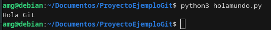

# Práctica de Git

## Descripción
Este proyecto es un ejemplo básico para demostrar el uso de Git. Incluye un programa en Python llamado `holamundo.py` que imprime un mensaje en la consola.

## Instrucciones de uso
Para ejecutar el programa `holamundo.py`, utiliza el siguiente comando:
```bash
python3 holamundo.py
```

## Comandos utilizados

- git init
- git add
- git commit
- git status
- git push

## El archivo .gitignore
El archivo .gitignore fue creado para evitar que archivos de prueba con la extensión .log se suban al repositorio. 

## Captura ejecucion del codigo



## Verificar localmente
 Usando el comando git status en la terminal. El archivo debug.log no debería aparecer en la lista de archivos "untracked" debido a la configuración en .gitignore.

## Verificar en GitHub 

Después de hacer push de los cambios al repositorio remoto en GitHub, puedes abrir el repositorio en el navegador. En la lista de archivos del repositorio, debug.log no debería estar presente, ya que .gitignore está configurado para que Git no lo incluya en el seguimiento ni lo suba al repositorio.


